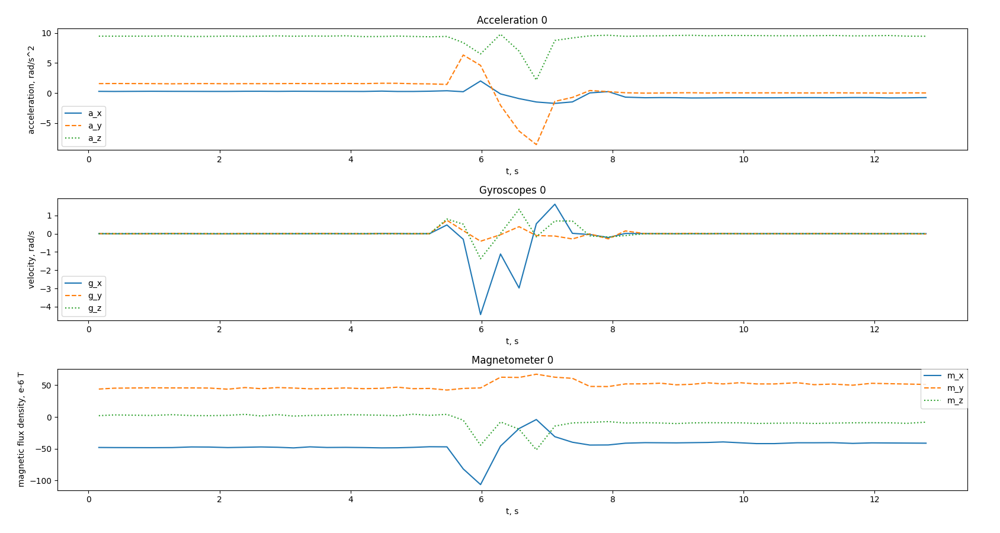
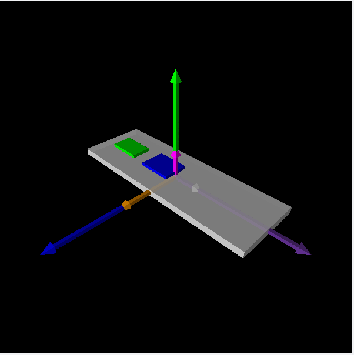

The repository comtains everything for IMU data reading via micropython firmware for [ESP32](https://micropython.org/download/ESP32_GENERIC/)

# Table of Contents
- [Table of Contents](#table-of-contents)
- [Install python packages ](#install-python-packages-)
- [ESP32 part  :](#esp32-part--)
  - [Flash the firmware ](#flash-the-firmware-)
    - [Micropython Installation instructions ](#micropython-installation-instructions-)
    - [Program uploading instruction ](#program-uploading-instruction-)
- [PC part](#pc-part)
  - [Read messages from USB device:](#read-messages-from-usb-device)
    - [Via picocom](#via-picocom)
    - [Via python script](#via-python-script)
  - [Code part ](#code-part-)
    - [Calibration](#calibration)
  - [IMU data reading](#imu-data-reading)
- [PC part](#pc-part-1)
  - [Data visualization](#data-visualization)
    - [Why do we use Redis?](#why-do-we-use-redis)
    - [Now we can allow us to work with pitch-yaw-roll](#now-we-can-allow-us-to-work-with-pitch-yaw-roll)
  - [Redis workflow structure](#redis-workflow-structure)
- [3D visualization](#3d-visualization)


# Install python packages <a name="install_env"></a>
Create python environment with all dependencies and activate it:

```
python -m venv /venv
source /venv/bin/activate  
pip install -r requirements.txt
```

# ESP32 part  <a name="esp_part"></a>:
All the code is stored in [esp32_part](esp32_part) 
Remember that the program entry point is [main.py](esp32_part/main.py)

## Flash the firmware <a name="esp_flash"></a>
### Micropython Installation instructions <a name="micropython_flash"></a>

If you are putting MicroPython on your board for the first time then you should first erase the entire flash using:

Check the port connected to the device:

```
ld /dev/ttyUSB*
```

```
esptool.py --chip esp32 --port /dev/ttyUSBn erase_flash
```

Then upload the needed micropython firmware [instruction](https://learn.sparkfun.com/tutorials/micropython-programming-tutorial-getting-started-with-the-esp32-thing/experiment-1-digital-input-and-output)  all available firmware is [here](https://micropython.org/download/ESP32_GENERIC/).

```
esptool.py --chip esp32 --port /dev/ttyUSB0 --baud 460800 write_flash -z 0x1000 FIRMWARE.bin  
```


<!-- From then on program the firmware starting at address 0x1000: -->
### Program uploading instruction <a name="esp_upload"></a>
Load the program via the instruction:
```
ampy --port /dev/ttyUSBn put esp32_part/main.py
ampy --port /dev/ttyUSBn put esp32_part/micropython_mpu9250
```


# PC part
## Read messages from USB device:

### Via picocom

Install picocom
```
sudo apt-get install picocom
```
Check the port connected to the device:

```
ld /dev/ttyUSB*
```
Use the port name when start reading data via picocom. Use default baudrate with *-b* flag
```
 sudo picocom /dev/ttyUSBn -b 115200
```

### Via python script

```
sudo python pc_part/IMU_serial_reading.py 
```

## Code part <a name="code_esp"></a>
All the code is stored in [esp32_part](esp32_part) 
Remember that the program entry point is [main.py](esp32_part/main.py)

### Calibration
To calibrate sensor, use the calibration function for gyroscope and magnetometer.

```
sensor = MPU9250(i2c)

sensor.ak8963.calibrate()
sensor.mpu6500.calibrate()
```
main.py example with sensor calibration:
```
import utime
from machine import I2C, Pin
from micropython_mpu9250.mpu9250 import MPU9250
import json
i2c = I2C(scl=Pin(22), sda=Pin(21))
sensor = MPU9250(i2c)

print("MPU9250 id: " + hex(sensor.whoami))

sensor.ak8963.calibrate()
sensor.mpu6500.calibrate()
print("Calibration complete")
while True:
    print("Gyro offset", sensor.mpu6500._gyro_offset)
    print("Mag offset", sensor.ak8963._offset)
    print("Mag scale", sensor.ak8963._scale)
    utime.sleep_ms(1000)
```
Store the results and use them later after sensor initialization:

```
sensor = MPU9250(i2c)

sensor.mpu6500._gyro_offset = ...
sensor.ak8963._offset = ...
sensor.ak8963._scale = ...

# start data reading
```


## IMU data reading

example for data reading:
```
import utime
from machine import I2C, Pin
from micropython_mpu9250.mpu9250 import MPU9250
import json
i2c = I2C(scl=Pin(22), sda=Pin(21))
sensor = MPU9250(i2c)

print("MPU9250 id: " + hex(sensor.whoami))

while True:
    data = {"acc": sensor.acceleration, "gyr": sensor.gyro, "mag": sensor.magnetic, "tem": sensor.temperature}
    print(json.dumps(data))
    utime.sleep_ms(1000)
```
# PC part
==To start the code on ESP, open the port via picocom and press *Ctrl+d*==

>The simplest example contains in [simple_serial_reading_to_csv.py](pc_part/simple_serial_reading_to_csv.py). We collect data from the */dev/ttyUSB0* port and then writes it to .csv file for further exploration.


## Data visualization

It is almost impossible to check if the sensor works correctly without visualization, therefore lets start with graphs.

The base for graph plotting script: [simple_visualize_graph.py](pc_part/simple_visualize_graph.py).


###  Why do we use Redis?
The data buffer of the serial port use queue to store data, therefore (since the Matplotlib is slow) the visualization will have a growing delay. So, in several seconds it will be hard to map the graph with real inertia of IMU.

***So, now we will use Redis.!.***

***[Redis installation guide](https://redis.io/docs/install/install-redis/install-redis-on-linux/)***

After installation you are ready to start redis service:
```
sudo systemctl start redis
```

Updated version of graph plotting script: [visualize_graphs_vs_redis.py](pc_part/visualize_graphs_vs_redis.py).

So, to start *reading* the data from IMU and store it to Redis, run the script:
Terminal 1:
```
sudo python pc_part/read_serial_vs_redis.py
```
Open the new terminal and run the *visualization* script:
Terminal 2:
```
sudo python pc_part/visualize_graphs_vs_redis.py
```

Also, we can speed up calculations, because of splitting up it to several processes.

### Now we can allow us to work with pitch-yaw-roll

## Redis workflow structure


# 3D visualization
Terminal 4:
```
sudo python pc_part/3d_visualization_vs_redis.py
```
***The visualization works if it runs via Debugger. I know, I know, vpython sucks. But easy <3***

